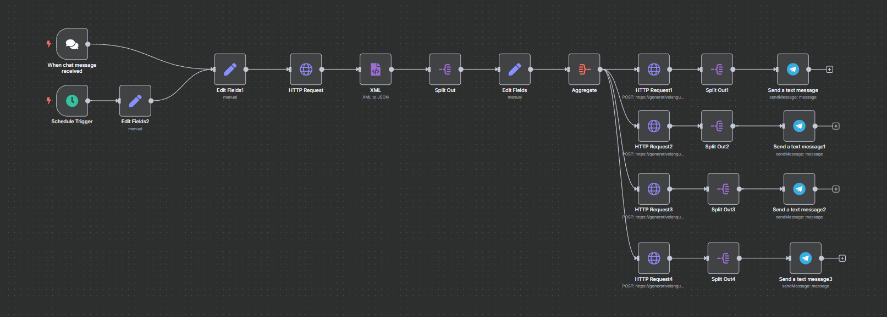

# Content Generator

## Overview

**DevOps LinkedIn Content Generator** is an automated workflow built with **n8n** that helps you create engaging, relevant, and high-quality LinkedIn posts in seconds. Now enhanced with **AI-powered image generation** and advanced diversification techniques, it ensures your content is not only impactful but also uniquely fresh every time.

Although it’s designed with DevOps professionals in mind, **you can easily adapt it to generate content for *any* topic** — whether it’s cloud, AI, project management, or personal branding.

## How It Works

1.  **Trigger**
      * The workflow can be started in two ways:
          * **Chat Trigger**: Send a message to the connected chat bot to specify a custom topic.
          * **Schedule Trigger**: It can run automatically at a set time each day using the schedule node.
2.  **Keyword Extraction**
      * It sends the topic to Google Autocomplete to fetch real-time keyword suggestions.
3.  **Dynamic Content & Style Selection**
      * A custom "Code" node acts as a **randomizer**, picking a unique writing style or specific focus for the day's posts. This ensures diverse tones and structures, avoiding repetition.
4.  **Content Generation**
      * It passes the keywords and the selected dynamic style to Google Gemini to generate **four distinct and unique LinkedIn post drafts**, each crafted with a different angle or persona.
5.  **AI Image Generation**
      * Using an external AI image generation service, the workflow creates a custom image that visually complements the generated post content and its unique daily style.
6.  **Delivery**
      * The posts and their accompanying images are automatically sent to your Telegram chat for quick review and sharing.

-----

## Changing the Topic

✅ **Use the Chat Box**

  * If you want a topic other than **DevOps**, just send a custom message to the chatbot (the **When chat message received** trigger in the workflow).
  * Whatever you type will replace the default topic and fetch keywords based on your input.

✅ **Change the Default Topic**

  * If you want to change the default topic that runs on schedule:
    1.  Open the workflow in **n8n**.
    2.  Find the node named **Edit Fields2** — here, the `topic` parameter is set to `"devops"` by default.
    3.  Change `"devops"` to whatever topic you like, e.g., `"AI trends"`, `"Cloud Security"`, `"Productivity Hacks"` — anything\!

-----

## Customizing the Prompts

✅ If you want to modify the style, length, or tone of the generated posts or images:

  * **Diverse Post Prompts**: Look for the nodes named **HTTP Request1**, **HTTP Request2**, **HTTP Request3**, and **HTTP Request4**. Each of these nodes sends a different base prompt template to Gemini, which you can edit in the **jsonBody** to adjust word count, tone, structure, or other specific instructions.
  * **Random Style Selector**: For even greater variety, adjust the `promptStyles` array within the **Random Post Style Selector** (Code node). Add more descriptive phrases or instructions to further diversify the daily output.
  * **Image Generation Prompt**: Find the **HTTP Request** node responsible for image generation (e.g., `HTTP Request5`). You can modify its `jsonBody` to alter the style, aspect ratio, or specific elements of the generated images, often by injecting the `randomPromptStyle` for alignment with the post.

-----

## Requirements

  * [n8n](https://n8n.io/) running locally or on your server
  * A valid Google Generative Language API key (for Gemini text generation)
  * Access to a **free AI image generation API** (e.g., Hugging Face Inference API, or free tiers of platforms like Leonardo.AI) and its API key.
  * A Telegram bot and its API token connected to your Telegram account
  * Basic understanding of editing nodes in n8n

-----

## Getting Started

1.  Clone this repository.
2.  Import `DevOps LinkedIn Content Generator.json` into your **n8n** instance.
3.  Add your API keys and Telegram credentials.
4.  Edit the topic and prompts as needed, including the new "Random Post Style Selector" code.
5.  Start the workflow and receive professional, diverse, and visually engaging LinkedIn posts daily — for DevOps or any other topic you want\!

-----

**Happy content generating\! 🚀**