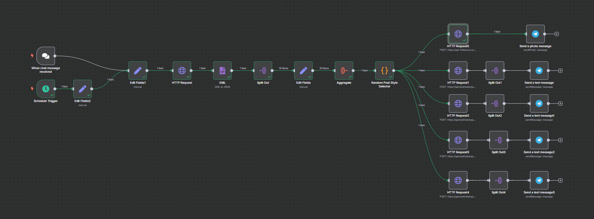

# Content Generator

## Overview

**DevOps LinkedIn Content Generator** is an automated workflow built with **n8n** that helps you create engaging, relevant, and high-quality LinkedIn posts in seconds.

Although it’s designed with DevOps professionals in mind, **you can easily adapt it to generate content for *any* topic** — whether it’s cloud, AI, project management, or personal branding.

## How It Works

1. **Trigger**

   * The workflow can be started in two ways:

     * **Chat Trigger**: Send a message to the connected chat bot to specify a custom topic.
     * **Schedule Trigger**: It can run automatically at a set time each day using the schedule node.
2. **Keyword Extraction**

   * It sends the topic to Google Autocomplete to fetch real-time keyword suggestions.
3. **Content Generation**

   * It passes the keywords to Google Gemini to generate multiple unique LinkedIn post drafts.
4. **Delivery**

   * The posts are split and automatically sent to your Telegram chat for quick review and sharing.

---

## Changing the Topic

✅ **Use the Chat Box**

* If you want a topic other than **DevOps**, just send a custom message to the chatbot (the **When chat message received** trigger in the workflow).
* Whatever you type will replace the default topic and fetch keywords based on your input.

✅ **Change the Default Topic**

* If you want to change the default topic that runs on schedule:

  1. Open the workflow in **n8n**.
  2. Find the node named **Edit Fields2** — here, the `topic` parameter is set to `"devops"` by default.
  3. Change `"devops"` to whatever topic you like, e.g., `"AI trends"`, `"Cloud Security"`, `"Productivity Hacks"` — anything!

---

## Customizing the Prompts

✅ If you want to modify the style, length, or tone of the generated posts:

* Look for the nodes named **HTTP Request1**, **HTTP Request2**, **HTTP Request3**, and **HTTP Request4**.
* Each of these nodes sends a different prompt template to Gemini.
* Open the node, and edit the **jsonBody** to change how the content is generated.
* You can adjust word count, tone, structure, hashtags, or any other instructions.

---

## Requirements

* [n8n](https://n8n.io/) running locally or on your server
* A valid Google Generative Language API key (Gemini)
* A Telegram bot and its API token connected to your Telegram account
* Basic understanding of editing nodes in n8n

---

## Getting Started

1. Clone this repository.
2. Import `DevOps LinkedIn Content Generator.json` into your **n8n** instance.
3. Add your API keys and Telegram credentials.
4. Edit the topic and prompts as needed.
5. Start the workflow and receive professional LinkedIn posts daily — for DevOps or any other topic you want!

---

**Happy content generating! 🚀**
